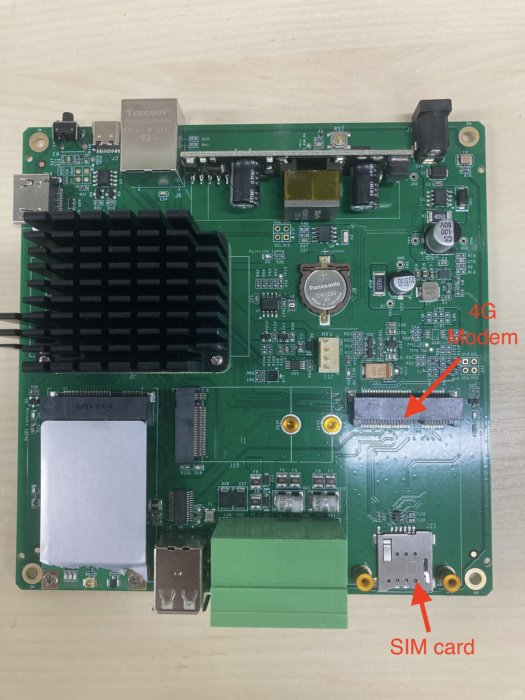
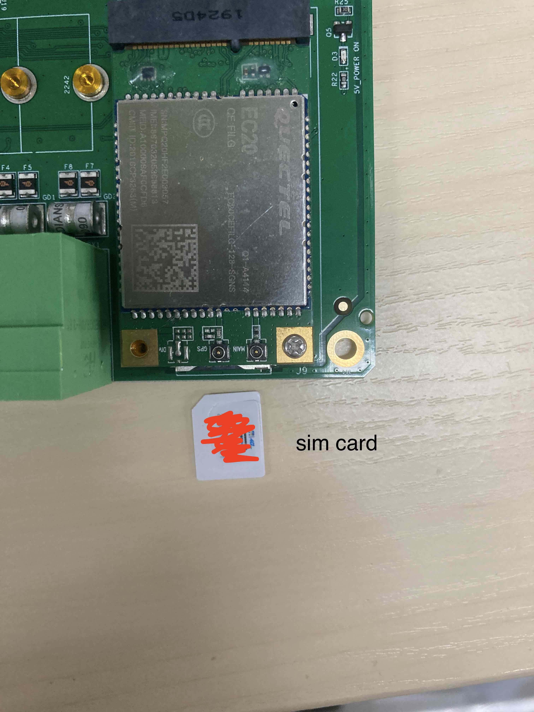
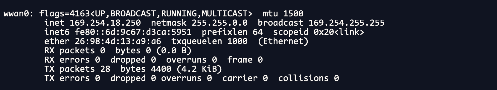

## Enable 4G model on H500

This guide will show how to enable 4G for Hummingbird H500

### Prerequirement

* Hummingbird H500

  

* 4G model(e.g EC20) 

  

* SIM card

* screw driver

* pppd-mgr(download from this repository) [download](./tools/pppd-mgr-3.0.0.deb)

  

### Step 1 plug 4G modem to h500

* Power off h500
* Get h500 PCBA from Case
* Plug 4G modem(i.e. EC20) to H500 PCIE slot


### Step 2 enable 4G modem software

* insert SIM card

  

* Power on H500

* Login to terminal via ssh

  > username:pi
  >
  > Password:Raspberry@2021

> for old hummingbird the passwd should be:raspberry

```bash
cp pppd-mgr-3.0.0.deb to /home/pi/
cd /home/pi; sudo apt-get install ./pppd-mgr-3.0.0.deb 
sudo systemctl restart pppd-mgr.service
```

make sure you could get the ppp interface by `ifconfig` e.g.




then try `ping 8.8.8.8` to check if your 4g interface is ok
