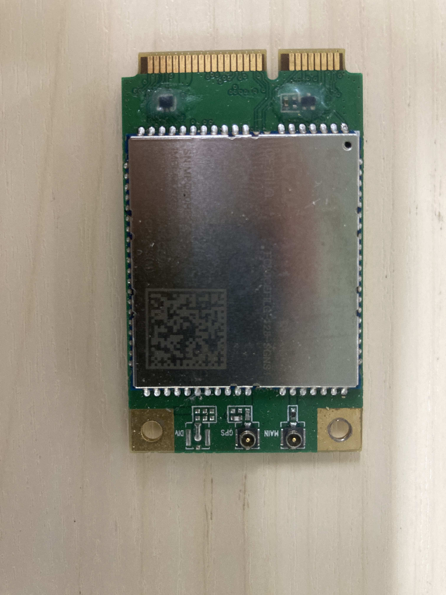

## Enable 4G model on H500

This guide will show how to enable 4G for Hummingbird H500

### Prerequirement

* Hummingbird H500

* 4G model(e.g EC20) 

  

* SIM card

* screw driver

* Pppd-mgr(download from this repository)

  